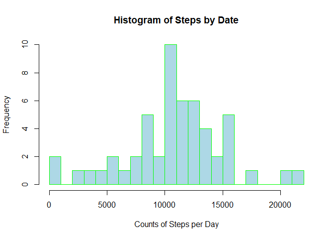
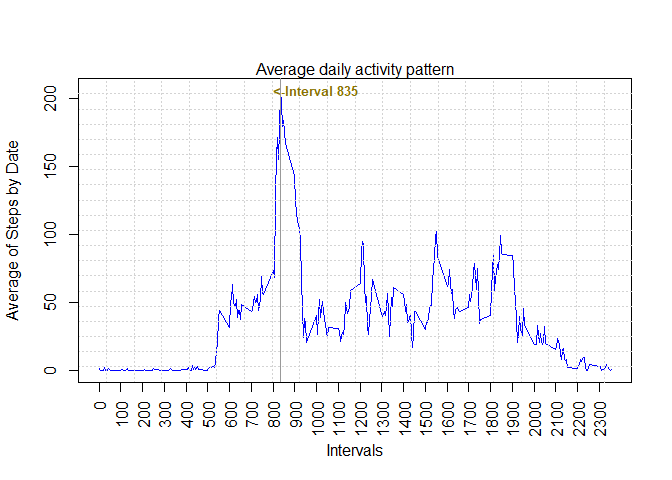
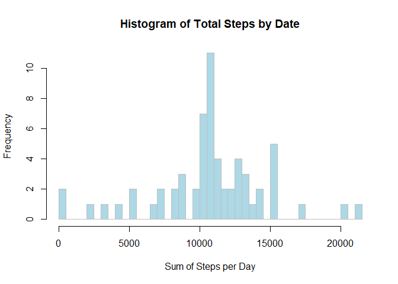
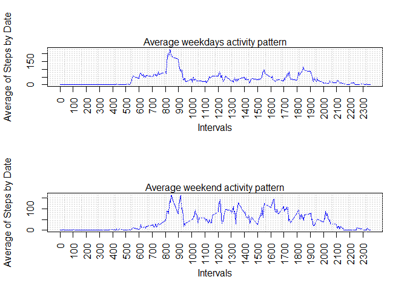

#### Initializing Libraries and Reading the data from Source Site

#####
library(RCurl)  
library(stringr)  
library(dplyr)  
library(ggplot2)  

```
## Loading required package: bitops
```

```
## 
## Attaching package: 'dplyr'
```

```
## The following objects are masked from 'package:stats':
## 
##     filter, lag
```

```
## The following objects are masked from 'package:base':
## 
##     intersect, setdiff, setequal, union
```

#### Read Data


```r
out <- read.csv("activity.csv")
```

#### First need to total count of steps by date

```r
out$date <- as.Date(out$date, format = "%Y-%m-%d")
grp <- group_by(out,date)
totals <- summarise(grp, count=n(), Steps = sum(steps))
```
#### Then create histogram that counts frequence of step counts


```r
hist(totals$Steps,breaks = 25,main = "Histogram of Steps by Date",xlab = "Counts of Steps per Day",  col = "lightblue", border = "green")
```

<!-- -->

#### Calculating the mean of the total of Steps taken by day

```r
meansteps <- mean(totals$Steps, na.rm = TRUE)
meansteps
```

```
## [1] 10766.19
```

#### Calculating the median of the total of Steps taken by day

```r
mediansteps <- median(totals$Steps, na.rm = TRUE)
mediansteps
```

```
## [1] 10765
```

#### Generating the Time Series plot
#### First need to create dataset with avg. number of steps by interval

```r
grp2 <- group_by(out,interval)
mean_intervals <- summarise(grp2, Msteps=mean(steps,na.rm = TRUE))
```

#### Generating the plot


```r
plot(mean_intervals$interval,mean_intervals$Msteps, type = "l", xlab = "Intervals", ylab = "Average of Steps by Date", col="Blue", lwd=0.5, col.axis="white")
abline(v = 835, col = "gray60")
grid(20,20)
axis(1, seq(0,max(mean_intervals$interval),100),las=2)
axis(2, seq(0,max(mean_intervals$Msteps),50))
mtext(side=3, "Average daily activity pattern",font=1)
text(x=1000, y=206, "<-Interval 835",col="gold4", font=2, cex=0.8)
```

<!-- -->

#### IMPUTING MISSING VALUES
#### 1) Calculating the number or NA values in data


```r
outNA <- out[is.na(out)]
length(outNA)
```

```
## [1] 2304
```

#### 2) Filling in all of the missing values in the dataset with mean of intervals and
#### 3) Create a new dataset with those new values (outimpute)

```r
outimpute <- out
library(dplyr)
outimpute <- inner_join(out,mean_intervals,by = "interval")
outimpute$steps <- ifelse(is.na(outimpute$steps), outimpute$Msteps, outimpute$steps)
```

#### 4) Make a histogram of the total number of steps taken each day


```r
grp2 <- group_by(outimpute,date)
totals2 <- summarise(grp2, count=n(), totalofSteps = sum(steps))
hist(totals2$totalofSteps,breaks = 35,main = "Histogram of Total Steps by Date",xlab = "Sum of Steps per Day",  col = "lightblue", border = "gray")
```

<!-- -->

#### Calculating the mean of the total of Steps taken by day, replaced NA's

```r
meansteps2 <- mean(totals2$totalofSteps)
diff <- meansteps2-meansteps
diff
```

```
## [1] 0
```
#### Calculating the median of the total of Steps taken by day, replaced NA's

```r
mediansteps2 <- median(totals2$totalofSteps)
diff2 <- mediansteps2-mediansteps
diff2
```

```
## [1] 1.188679
```
##### There is a little difference of 1.18 in the median but 0 in the means

### Create a new factor variable weekday or weekend

```r
outimpute$week <- factor(ifelse(weekdays(outimpute$date) %in% c("Monday","Tuesday","Wednesday","Thursday","Friday"),"weekday","weekend"))
```

#### Generate the graph with two panels, Weekdays and Weekends


```r
weekdaydata <- outimpute %>% 
    select(interval,steps,week) %>%
    filter(week == "weekday")
```

```
## Warning: `as_dictionary()` is soft-deprecated as of rlang 0.3.0.
## Please use `as_data_pronoun()` instead
## This warning is displayed once per session.
```

```
## Warning: `new_overscope()` is soft-deprecated as of rlang 0.2.0.
## Please use `new_data_mask()` instead
## This warning is displayed once per session.
```

```
## Warning: The `parent` argument of `new_data_mask()` is deprecated.
## The parent of the data mask is determined from either:
## 
##   * The `env` argument of `eval_tidy()`
##   * Quosure environments when applicable
## This warning is displayed once per session.
```

```
## Warning: `overscope_clean()` is soft-deprecated as of rlang 0.2.0.
## This warning is displayed once per session.
```

```r
weekenddata <- outimpute %>% 
    select(interval,steps,week) %>%
    filter(week == "weekend")
par(mfrow = c(2,1))    
## Plot weekday data
grp3 <- group_by(weekdaydata,interval)
mean_intervals2 <- summarise(grp3, Mesteps=mean(steps))
plot(mean_intervals2$interval,mean_intervals2$Mesteps, type = "l", xlab = "Intervals", ylab = "Average of Steps by Date", col="Blue", lwd=0.5, col.axis="white")
grid(20,20)
axis(1, seq(0,max(mean_intervals2$interval),100),las=2)
axis(2, seq(0,max(mean_intervals2$Mesteps),50))
mtext(side=3, "Average weekdays activity pattern",font=1)
## Plot weekend data
grp4 <- group_by(weekenddata,interval)
mean_intervals3 <- summarise(grp4, Me2steps=mean(steps))
plot(mean_intervals3$interval,mean_intervals3$Me2steps, type = "l", xlab = "Intervals", ylab = "Average of Steps by Date", col="Blue", lwd=0.5, col.axis="white")
grid(20,20)
axis(1, seq(0,max(mean_intervals3$interval),100),las=2)
axis(2, seq(0,max(mean_intervals3$Me2steps),50))
mtext(side=3, "Average weekend activity pattern",font=1)
```

<!-- -->

